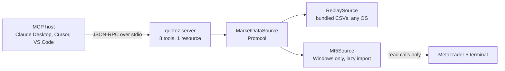

# QUOTEZ

**Market data for agents. Read only by construction, not by configuration.**

One file to start with: [`src/quotez/server.py`](src/quotez/server.py). Eight tools in a fixed
registration order, and no write path anywhere in it to find.

[](https://github.com/PNX89/QUOTEZ/actions/workflows/ci.yml)
[](https://www.python.org/)
[](LICENSE)


Nothing above was typed by hand. The frame replays what the session actually printed, and this
repository's own suite re-runs it on every push and diffs the result, so an out of date picture
is a red build rather than a flattering one. Untruncated at
[pnx89.github.io/QUOTEZ](https://pnx89.github.io/QUOTEZ/).

An MCP server that exposes MetaTrader 5 market data as typed, read only tools an LLM agent can
call. Python 3.11 or newer, one runtime dependency, stdio transport. The badge stops at 3.13
because that is where the classifiers stop; CI runs a 3.14 leg as well, marked advisory, and 3.14
joins the badge once it has been green long enough to be a promise rather than a hope.

An agent is only as good as the tools you hand it, and market data is where a sloppy tool does
real damage. The model restates whatever a tool returns as fact, so a payload with no units, no
timezone and no provenance becomes a confident sentence about a price someone might act on. QUOTEZ
answers with generated output schemas rather than text blobs, UTC everywhere, a `synthetic` flag
on every payload, and no write path in the code.

This is one tool built so that it cannot do damage, which is a smaller and more checkable question
than whether an agent as a whole can be trusted with tools. That larger one is
[QUELLZ](https://github.com/PNX89/QUELLZ)'s.

## Scope and limits

- Read only: no `order_send`, no `order_check`, no `symbol_select`, no writes of any kind.
- Live MetaTrader data needs Windows and a running terminal; the wheels are win_amd64 only.
- The default source replays generated data and labels every payload `synthetic: true`.
- Times are UTC and every bar is labelled by its open, the left edge of its interval.

## Example agent session

Real output, not a paste. Regenerate it with `uv run python examples/agent_session.py`;
`tests/test_readme.py` asserts this block byte for byte against that command's stdout. The replay
prices are generated, not recorded from any market.

<!-- transcript:start -->
```
QUOTEZ over an in-memory MCP client, source=replay.
Every price below is generated. This repository bundles no real market data.

>>> list_symbols(group="*FX*")
{
  "source": "replay",
  "synthetic": true,
  "count": 2,
  "symbols": [
    {"name": "SYNTH_FX_ALPHA", "description": "Synthetic FX pair Alpha", "digits": 5, "point": 1e-05},
    {"name": "SYNTH_FX_BETA", "description": "Synthetic FX pair Beta", "digits": 3, "point": 0.001}
  ]
}

>>> get_quote(symbol="SYNTH_FX_ALPHA")
{
  "symbol": "SYNTH_FX_ALPHA",
  "time": "2026-06-12T13:59:00Z",
  "bid": 1.08044,
  "ask": 1.08056,
  "spread_points": 12,
  "source": "replay",
  "synthetic": true
}

>>> get_bars(symbol="SYNTH_FX_ALPHA", timeframe="H1", count=5)
{
  "symbol": "SYNTH_FX_ALPHA",
  "timeframe": "H1",
  "source": "replay",
  "synthetic": true,
  "count": 5,
  "bars": [
    {"time": "2026-06-12T08:00:00Z", "open": 1.07985, "high": 1.08231, "low": 1.07978, "close": 1.08125, "tick_volume": 4257, "spread": null},
    {"time": "2026-06-12T09:00:00Z", "open": 1.08125, "high": 1.0844, "low": 1.08113, "close": 1.08302, "tick_volume": 2501, "spread": null},
    {"time": "2026-06-12T10:00:00Z", "open": 1.08302, "high": 1.08439, "low": 1.08298, "close": 1.08368, "tick_volume": 1643, "spread": null},
    {"time": "2026-06-12T11:00:00Z", "open": 1.08368, "high": 1.08395, "low": 1.08036, "close": 1.08097, "tick_volume": 1570, "spread": null},
    {"time": "2026-06-12T12:00:00Z", "open": 1.08097, "high": 1.08284, "low": 1.08084, "close": 1.08159, "tick_volume": 2589, "spread": null}
  ]
}

>>> symbol_info(symbol="SYNTH_FX_ALPHA")
{
  "name": "SYNTH_FX_ALPHA",
  "description": "Synthetic FX pair Alpha",
  "digits": 5,
  "point": 1e-05,
  "spread": 12,
  "spread_float": true,
  "trade_stops_level": 10,
  "trade_freeze_level": 0,
  "trade_tick_value": 1.0,
  "trade_tick_size": 1e-05,
  "trade_contract_size": 100000.0,
  "volume_min": 0.01,
  "volume_max": 100.0,
  "volume_step": 0.01,
  "currency_base": "SYA",
  "currency_profit": "SYN",
  "currency_margin": "SYA",
  "source": "replay",
  "synthetic": true
}

A symbol that does not exist, to show what the model actually sees:

>>> get_quote(symbol="NOT_A_SYMBOL")
is_error: true
Error executing tool get_quote: Symbol 'NOT_A_SYMBOL' is not available on this server.
```
<!-- transcript:end -->

## Quickstart

One command, nothing to configure, no MetaTrader install anywhere:

```
uvx --from git+https://github.com/PNX89/QUOTEZ quotez --source replay
```

QUOTEZ is not published to PyPI, so the git form is the install; append `@main`, a tag or a commit
to pin a ref, per [uv's dependency
documentation](https://docs.astral.sh/uv/concepts/projects/dependencies/). It then appears to
hang, because stdout is the JSON-RPC wire and a host drives it. To watch it work without a host,
clone the repository and run the example session, which drives the same server from an in-process
client:

```
git clone https://github.com/PNX89/QUOTEZ && cd QUOTEZ
uv run python examples/agent_session.py
```

On Windows, against a terminal already running and logged in:

```
uvx --from "quotez[mt5] @ git+https://github.com/PNX89/QUOTEZ" quotez --source mt5
```

The console script is the only entry point that takes flags, and flags win over the environment.
`mcp run src/quotez/server.py` also serves this server through the module level `mcp` global, but
it forwards nothing, so that path reads the variables instead.

| Flag | Environment variable | Default | Meaning |
|---|---|---|---|
| `--source` | `QUOTEZ_SOURCE` | `replay` | `replay` reads the bundled generated files, `mt5` reads a live terminal |
| `--symbols` | `QUOTEZ_SYMBOLS` | empty | Comma separated whitelist, case insensitive. Empty exposes everything the source has |
| `--max-bars` | `QUOTEZ_MAX_BARS` | `1000` | Most bars one call may return, 1 to 5000 |
| `--log-level` | `QUOTEZ_LOG_LEVEL` | `INFO` | Logging threshold. Records always go to stderr, because stdout is the wire |

## Connect it to a host

The hosts do not agree on the configuration key, and getting `mcpServers` versus `servers` wrong
is the usual reason a server never appears.

| Host | File | Key |
|---|---|---|
| Claude Desktop | `~/Library/Application Support/Claude/claude_desktop_config.json` on macOS, `%APPDATA%\Claude\claude_desktop_config.json` on Windows | `mcpServers` |
| Cursor | `.cursor/mcp.json` | `mcpServers` |
| VS Code | `.vscode/mcp.json` | `servers`, and add `"type": "stdio"` next to `command` |
| Claude Code | no file, use the CLI | `claude mcp add quotez -- uv tool run --from git+https://github.com/PNX89/QUOTEZ quotez --source replay` |

```json
{
  "mcpServers": {
    "quotez": {
      "command": "/absolute/path/to/uv",
      "args": ["tool", "run", "--from", "git+https://github.com/PNX89/QUOTEZ",
               "quotez", "--source", "replay"]
    }
  }
}
```

**`command` must be the absolute path from `which uv`.** A host spawns the server with a near
empty PATH, so a bare `uv` is the single most common reason a server silently fails to connect.

## Tools

Eight tools, registered in this order, which is the order `tools/list` returns; clients cache that
list, so the order is fixed on purpose. One resource, `symbols://list`, serves the same instrument
universe as `application/json`.

| Tool | Arguments | Returns | Access | Replay source | MetaTrader source |
|---|---|---|---|---|---|
| `list_symbols` | `group` optional, MetaTrader group syntax | `SymbolList` | read | 4 generated instruments | `symbols_get(group=...)` |
| `get_quote` | `symbol` | `Quote` | read | derived from the last stored bar | `symbol_info_tick` |
| `get_bars` | `symbol`, `timeframe`, `count` (1 to 5000, capped by `--max-bars`) | `BarSeries` | read | M1 rolled up locally | `copy_rates_from_pos` |
| `get_bars_range` | `symbol`, `timeframe`, `start`, `end` | `BarSeries` | read | M1 rolled up locally | `copy_rates_range` |
| `symbol_info` | `symbol` | `SymbolSpec` | read | from `symbols.json` | `symbol_info` |
| `get_account` | none | `Account` | read | placeholder figures, `synthetic: true` | `account_info`, login masked |
| `list_positions` | none | `PositionList` | read | always empty | `positions_get` |
| `list_orders` | none | `OrderList` | read | always empty | `orders_get` |

`list_symbols` takes MetaTrader's own group filter syntax rather than inventing one: `*` wildcards
at the start and end of a pattern, comma separated conditions, and `!` to negate one. Inclusions
must come before exclusions, so `"*, !*USD*"` is everything except the USD instruments while
`"!*USD*, *"` matches everything. `Mt5Source` hands the string to
[`symbols_get`](https://www.mql5.com/en/docs/python_metatrader5/mt5symbolsget_py); the replay
source runs the same syntax through `quotez.groups`, so both answer a filter identically.

Every tool returns a Pydantic model, so the SDK derives an `outputSchema` from the return
annotation, fills `structuredContent`, and validates the payload before it leaves the server. A
`BaseModel` is used unwrapped, which is why `get_bars` returns an object with a `bars` key rather
than `{"result": ...}`.

## How it works



`MarketDataSource` is the seam the whole server is written against. Nothing above it imports
MetaTrader5, and `Mt5Source` resolves the extension inside a private helper on first use rather
than at module import, so `import quotez` works where no wheel exists. That is what makes
`ReplaySource` a first class implementation instead of a mock: the tool layer cannot tell the two
apart, so the whole suite exercises the real code path with no terminal installed.

The bundled data is four generated instruments (`SYNTH_FX_ALPHA`, `SYNTH_FX_BETA`,
`SYNTH_IDX_GAMMA`, `SYNTH_MTL_DELTA`), 3600 M1 bars each, 08:00 to 14:00 UTC on weekdays from
2026-06-01 to 2026-06-12, with nine session breaks in it, eight overnight and one across a
weekend, because a gapless series is the series that hides an aggregation bug.
`scripts/generate_replay_data.py` produced the files once from a seeded `random.Random` and the
output is committed. CSVs are read through `importlib.resources`, never `Path(__file__).parent`,
which works in a checkout and breaks under the zipped install `uvx` performs.

## Tools and resources are not the same thing

A tool is what the MODEL decides to call; a resource is what the APPLICATION decides to load.
`get_bars` is model driven: it picks a symbol, a timeframe and a count in the middle of reasoning.
`symbols://list` is application driven: a host pins the universe into context once, before the
model has decided anything. That is why it is not incidental duplication of `list_symbols`, which
is a filtered search the model runs on purpose.

The obvious next resource, `bars://{symbol}/{timeframe}`, was deliberately not built: it
duplicates `get_bars` for the same data, and a URI with placeholders is a resource template, which
leaves `resources/list` for `resources/templates/list` and is surfaced poorly or not at all by
many hosts. A test asserts no resource templates are registered.

## Timeframe aggregation

The replay source stores one base timeframe, M1, and `quotez.aggregate` rolls up M5, M15, M30, H1,
H4 and D1 from it. One stored copy, one roll up, testable on its own, which matters because its
failure mode is silent: a wrong aggregation returns plausible numbers forever and never raises.

The MetaTrader source rolls nothing up. A terminal already holds every period, so it is asked for
the timeframe directly; deriving them again from M1 would be slower and would disagree with the
charts the operator has open. The two sources therefore answer the same call slightly differently
on D1, H4 and `spread`, which is in Limitations rather than left for you to find.

The invariants of the roll up, each of which is a test name:

1. M1 is the only base timeframe. Everything coarser is derived.
2. Buckets are wall clock, computed by floor division on the epoch second, never by grouping every
   N rows positionally.
3. Targets are whole multiples of 60 seconds. Anything else raises `InvalidRequest`.
4. OHLC is first open, max high, min low, last close.
5. `tick_volume` is summed. `spread` is not: it is a point in time property of a quote, so an
   aggregated bar reports `null`.
6. Bars are labelled by their left edge, in UTC.
7. An incomplete trailing bucket is dropped rather than emitted as a partial bar. A bucket is
   emitted only when the input holds a bar at or after that bucket's end.
8. Empty input returns an empty list.

Invariant 2 earns its tests. Positional grouping agrees with wall clock bucketing on a gapless
series and disagrees the moment there is a hole: grouping 360 bar sessions in fours puts Friday's
close and Monday's open in one bar and calls it a four hour candle. Invariant 7 is its pair,
because a session ending is not the same event as the data running out.

## Safety design

The claim is structural, not configurable. **This codebase contains no write path.** There is no
`order_send`, no `order_check`, no `symbol_select`, no MarketWatch mutation and no file write
anywhere in `src/quotez/`. No configuration can turn a write on, because there is nothing to turn
on.

Two tests hold that in place, and the second one is the one that means something. The first greps
the package for those three MetaTrader calls: cheap, covers every file, and satisfied by a name
assembled at run time. The second walks the AST of `mt5source.py` and asserts the positive
property instead, that the set of attributes this package reads off the terminal module is exactly
the read calls its own docstring names plus the seven timeframe constants, with nothing reached
through `getattr` and nothing rebound to a second variable. `_mt5()` returns the whole MetaTrader5
module, so the absence of three names out of several hundred attributes proves very little on its
own. Five deliberately broken snippets are checked against that walk so the walk itself is known
to fail when it should.

Every tool is declared `ToolAnnotations(read_only_hint=True, open_world_hint=False)`. That
declaration is a courtesy to clients and nothing more: the MCP specification tells clients to
treat tool annotations as untrusted unless they come from a trusted server. `read_only_hint=True`
describes the tool, it does not constrain the client, and the property a reviewer can check is the
absence of the calls rather than the presence of the flag. Mapped onto the specification's own
[Security Considerations for
tools](https://modelcontextprotocol.io/specification/2026-07-28/server/tools), including the
requirement this server does not meet:

| Specification requirement | QUOTEZ | Where |
|---|---|---|
| Validate all tool inputs | Yes | JSON Schema derived from the type hints, `Literal` timeframes, `Field(ge=1, le=5000)` on `count`, plus runtime checks in the handlers |
| Implement proper access controls | Yes | the symbol whitelist is applied to every tool and to the resource, not only to the getters |
| Rate limit tool invocations | No | not implemented, and listed in Limitations. A stdio server is a child process of exactly one host, so the host owns the rate limit |
| Sanitize tool outputs | Yes | the account login is masked to its last four digits, the broker, server and account holder names are never returned at all, and `synthetic` is a required field on every payload |

A blocked symbol is reported as `SymbolNotFound` with the message a typo gets, "Symbol 'X' is not
available on this server." A distinct "not permitted" would turn the whitelist into a discovery
oracle for instruments an operator chose not to expose.

Errors take one of two channels, chosen by whether a smarter model could have avoided the failure.
A misspelled symbol could be, so `SymbolNotFound` and `InvalidRequest` are ordinary exceptions,
which become tool errors the model can read and retry from. A terminal that is not running could
not, so `SourceUnavailable` is raised as `MCPError`, a protocol error with no result at all.
Nothing here returns an error string: a returned string carries `is_error=False` and reads as a
successful answer. A test calls every tool with bad input and asserts the flag.

## Design decisions

**`mcp>=2.0.0,<3` and `MCPServer`, not the v1 pin and `FastMCP`.** The SDK still offers
`mcp>=1.28,<2` for people who have not migrated, but a v1 era server gives itself away in three
seconds: `from mcp.server.fastmcp import FastMCP`. The [migration
guide](https://py.sdk.modelcontextprotocol.io/migration/) has the renames. The low level `Server`
was the alternative and no longer auto wraps return values, so it meant hand writing JSON Schema
for eight tools.

**Typed Pydantic returns, not text blobs.** Most public MCP servers return prose and leave the
model parsing it. Here the return annotation is the output schema, so typed costs nothing and buys
validation before the payload leaves the server.

**Two bar tools, not one with optional arguments.** JSON Schema cannot express mutual exclusivity,
so a single `get_bars(count or start..end)` would push "either of these but not both" onto the
model as prose. Two tools have two fully valid schemas, and the "both given, neither given" error
class stops existing.

**Generated data, not a real feed.** A licensing decision, not a preference. MetaTrader exports
are the broker's licensed feed, and for index and equity CFDs the underlying is exchange licensed.
Yahoo's help pages state the restriction in as many words, [you must not redistribute information
displayed on or provided by Yahoo Finance](https://help.yahoo.com/kb/SLN2310.html), and its
[developer API terms](https://legal.yahoo.com/us/en/yahoo/terms/product-atos/apiforydn/index.html)
separately restrict selling or sublicensing access. [HistData's
FAQ](https://www.histdata.com/f-a-q/) grants no redistribution rights at all; it says only that
the data comes with no warranty, and silence is not a licence. Committing any of it to an MIT
repository would relicense data I have no right to relicense.

**The standard library, not pandas or numpy.** At bundled CSV scale `csv` plus `datetime` plus
dataclasses is enough and the tree stays auditable. That tree is worth naming honestly though, all
of it: `mcp` 2.x is one direct dependency that pulls anyio, httpx2, jsonschema, mcp-types,
opentelemetry-api, pydantic, pyjwt with its crypto extra, python-multipart, sse-starlette,
starlette, typing-extensions, typing-inspection and uvicorn, plus pywin32 on Windows. The crypto
extra brings cryptography, cffi and pycparser in behind it. That is a bigger footprint than v1,
and a test reads the committed `uv.lock` and fails if this list stops matching it, because a
paragraph that exists to name the tree is worth nothing if it names most of the tree.

**No `run_backtest` tool.** A backtest is compute unbounded, needs far more than a
`MarketDataSource`, and would duplicate [QUACKZ](https://github.com/PNX89/QUACKZ), so the pair
would read as two half projects instead of two focused ones. For the same reason the guardrails
here are domain local: input validation, bounded queries, a fixed instrument universe, no side
effects. General agent guardrails belong in [QUELLZ](https://github.com/PNX89/QUELLZ), not
reinvented five times.

## Limitations

- **No continuous integration runner exercises the live MetaTrader path**, anywhere. There is no
  non-Windows wheel and no runner has a terminal or a broker account. The Windows job proves the
  extension imports and that `Mt5Source` reports a missing terminal cleanly, and that is all.
  `Mt5Source`'s field mapping is the least exercised code here, covered by fake module tests.
- `MetaTrader5` is Windows only and publishes no source distribution, so `pip install quotez[mt5]`
  is a no-op on macOS and Linux by design. A test asserts the environment marker keeps it that
  way.
- [`initialize()`](https://www.mql5.com/en/docs/python_metatrader5/mt5initialize_py) launches the
  terminal if it is not already running, and the whole operation is bounded by its `timeout`
  argument, documented as defaulting to 60000 milliseconds. The page does not put a figure on the
  launch itself, so treat 60 seconds as the ceiling on the call rather than as a measured startup
  time. QUOTEZ opens the connection once in the server lifespan rather than per call, so whatever
  it costs lands at startup instead of making the first tool call look hung.
- **The two sources do not agree on where a D1 or an H4 bucket starts.** The replay roll up floors
  on the epoch second, so D1 opens at 00:00 UTC and H4 at 00, 04, 08, 12, 16 and 20 UTC. A
  MetaTrader terminal aligns D1 and H4 to the broker's server day, which is commonly UTC+2 or
  UTC+3, so the same `get_bars(symbol, "D1")` returns a candle with a different open time and
  different OHLC depending on which source is configured. Nothing here resamples the terminal's M1
  to hide that, because a bar that disagrees with the operator's own chart is worse than a
  documented offset.
- For the same reason, `spread` is null on every replay bar above M1 and set on every MetaTrader
  bar. The roll up clears it on purpose; the terminal reports its own value on every timeframe and
  QUOTEZ passes that through rather than discarding data the source gave it.
- `copy_rates_from_pos` and `copy_rates_range` are silently capped by the terminal's "Max. bars in
  chart" setting, so a request inside the server's own cap can still come back short and nothing
  in the MetaTrader API says so.
- `get_bars` skips the bar the terminal is still building, so its newest bar is always closed.
  `get_bars_range` does not, because the bounds are the caller's: an `end` inside the current
  interval returns that interval's partial bar.
- [`symbol_info()` returns
  `None`](https://www.mql5.com/en/docs/python_metatrader5/mt5symbolinfo_py) for an unknown symbol
  instead of raising, as does `symbols_get()` on error. Every call site here checks, but that is
  the shape of the API being wrapped.
- MetaTrader stores bar and tick times in UTC with no shift, while a naive Python `datetime`
  resolves against the local zone; the [copy_rates_range
  documentation](https://www.mql5.com/en/docs/python_metatrader5/mt5copyratesrange_py) says so.
  Every outbound timestamp is built with `tz=UTC` and naive inputs are rejected, but this is the
  trap that silently shifts a whole series by an hour.
- No rate limiting. A stdio server is a child process of one host, and the host owns that.
- The replay data is sample scale and generated: 4 instruments, 3600 M1 bars each, ten trading
  days. It demonstrates the tools and exercises the aggregation, and it is neither a research
  dataset nor a market.
- Version 0.1.0 is read only and stdio only, with no prompts capability, no SSE or streamable HTTP
  transport and no OAuth.

## Why I built this

I run walk forward research on index data and keep MetaTrader terminals around for the FX and
metals side of it, so both halves of this were already on my desk. What made me write it was
watching an agent restate a number from a badly typed tool as though it were a fact, with no unit,
no timezone and nothing saying where it came from. In market data that is not cosmetic: a bar
labelled by its close instead of its open, or a timestamp quietly shifted into local time, gives
an answer that looks right and is off by an hour. So this is mostly decisions about provenance and
about what a tool may claim, wrapped around a little aggregation code.

## Development

```
uv sync --dev
uv run pytest
uv run ruff check .
uv run ruff format --check .
uv run mypy
```

259 tests, no network, a few seconds, and identical on macOS, Linux and Windows. That count is
asserted against a real collection run, because a number in a README is a number nobody updates.

## License

MIT. See [LICENSE](LICENSE).

<!-- toolset:start -->

Part of the Q...Z toolset, all of it designing for the failure that does not announce itself:

- [QUACKZ](https://github.com/PNX89/QUACKZ), deflating a backtest that only looks good because
  it was picked out of two hundred.
- QUOTEZ, this one: market data an agent can read and cannot act on.
- [QUELLZ](https://github.com/PNX89/QUELLZ), measuring what prompt-injection containment costs
  in utility as well as in attack rate.
- [QUIDZ](https://github.com/PNX89/QUIDZ), refusing the outbound payment that would have gone
  out twice.
- [QUESTZ](https://github.com/PNX89/QUESTZ), stopping a scraper before it writes a CSV from a
  page that changed shape.
- [QUIZZ](https://github.com/PNX89/QUIZZ), answering what a statistic said at the time, and
  refusing when it cannot.
- [QUARANTINEZ](https://github.com/PNX89/QUARANTINEZ), treating an outcome the venue never
  confirmed as terminal rather than as a retry.
- [QUENCHZ](https://github.com/PNX89/QUENCHZ), deciding in the open what a tool server gets free
  while it is still somebody's subprocess.
- [QUILTZ](https://github.com/PNX89/QUILTZ), proving infrastructure code wrong without a cloud
  account, and saying what that cannot show.
- [QUAYZ](https://github.com/PNX89/QUAYZ), telling a crash loop from an OOMKill, and naming the
  failure that no single field finds.
- [QUARRYZ](https://github.com/PNX89/QUARRYZ), keeping every version a statistical office
  published, and failing the build when it quietly issues another.
- [QUASHZ](https://github.com/PNX89/QUASHZ), refusing a row whose outcome had not been decided
  yet when the decision would have been made.
- [QUALMZ](https://github.com/PNX89/QUALMZ), a fixed number of looks at the holdout, where
  re-running the same configuration does not buy another.
- [QUEUEZ](https://github.com/PNX89/QUEUEZ), ordering a feed by its sequence, because on a real
  recorded session the clock goes backwards.
- [QUANDARYZ](https://github.com/PNX89/QUANDARYZ), counting the distinct screens a component can
  settle into when its responses arrive out of order.
- [QUIETZ](https://github.com/PNX89/QUIETZ), watching whether the data arrived rather than
  whether the server answered.

<!-- toolset:end -->
